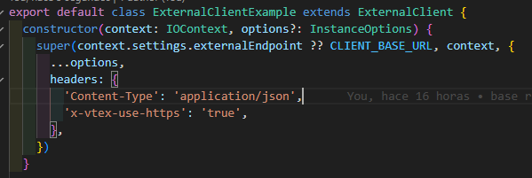

# APP

## INTRODUCTION

## Architecture

## DEVELOPMENT

## Get started

## DOCUMENTATION

# SPECIFICATIONS FOR BASE REPO:

## Cron filter:

Our middleware will filter any cron requests returning status 204. The purpose of this middleware is to keep active these services. Else, should these services stop receiving requests, they will be automatically disabled by VTEX. Thus, after disabled, the first request to be received after disabled will return timeout error. To avoid this, we have created cron jobs to send requests to these services every 5 minutes. However, we need to filter these requests to avoid creating payment with cron requests.

Example of cron request created to keep services active:

<p>
  
</p>

## Global variables set from administrator:

If you want to manage key global variables from the admnistration panel so as to hide any keys from the code, you can do it by the following steps:

1. Manifest document:


2. Index document:
   

3. If you want to use the global variables you can do as follows (example):
   

You have to access context.settings.externalEndpoint in this case, but you can add any other global variable you want.

## GraphQL query:

To use the GraphQL query, you have to enter admin panel, search for GraphiQL and app name according to manifest and enter the following query:


```
query getUniversities($country: String!) {
  getUniversitiesResolver(country: $country) {
    name
    domains
    state_province
    web_pages
    country
    alpha_two_code
  }
}
```
